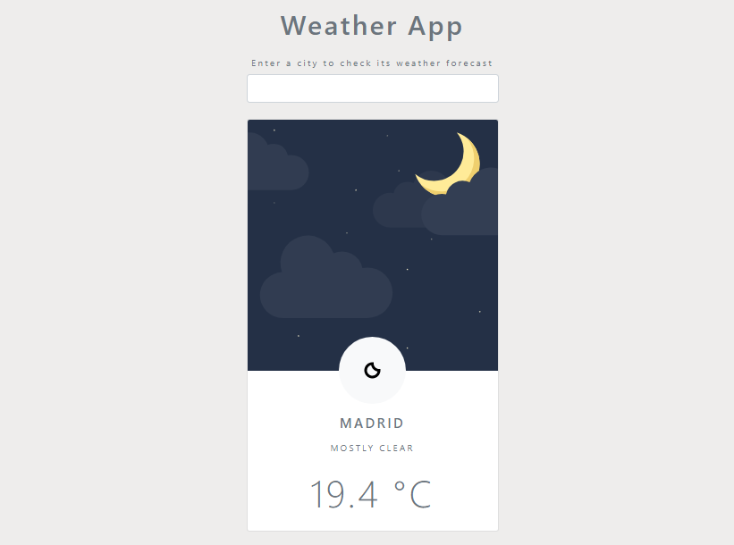

# Weather App
Una sencilla app que permite comprobar qué momento del día es y qué tiempo hace en una determinada ciudad.

  

Descripción
-------------
* Diseño responsive a través de Bootstrap.
* Formulario para introducir el nombre de la ciudad sobre la que se quiere conocer el tiempo.
* Envío de la solicitud de información a la API de AccuWeather.
* Recogida de los datos para mostrar en pantalla: momento del día, clima y temperatura.
* Uso de Local Storage para almacenar la última ciudad consultada.

Características
-------------
* HTML5
* CSS3
* JS
* [Fetch API](https://developer.mozilla.org/es/docs/Web/API/Fetch_API)
* [AccuWeather API](https://developer.accuweather.com)
* [Bootstrap](https://getbootstrap.com/)
